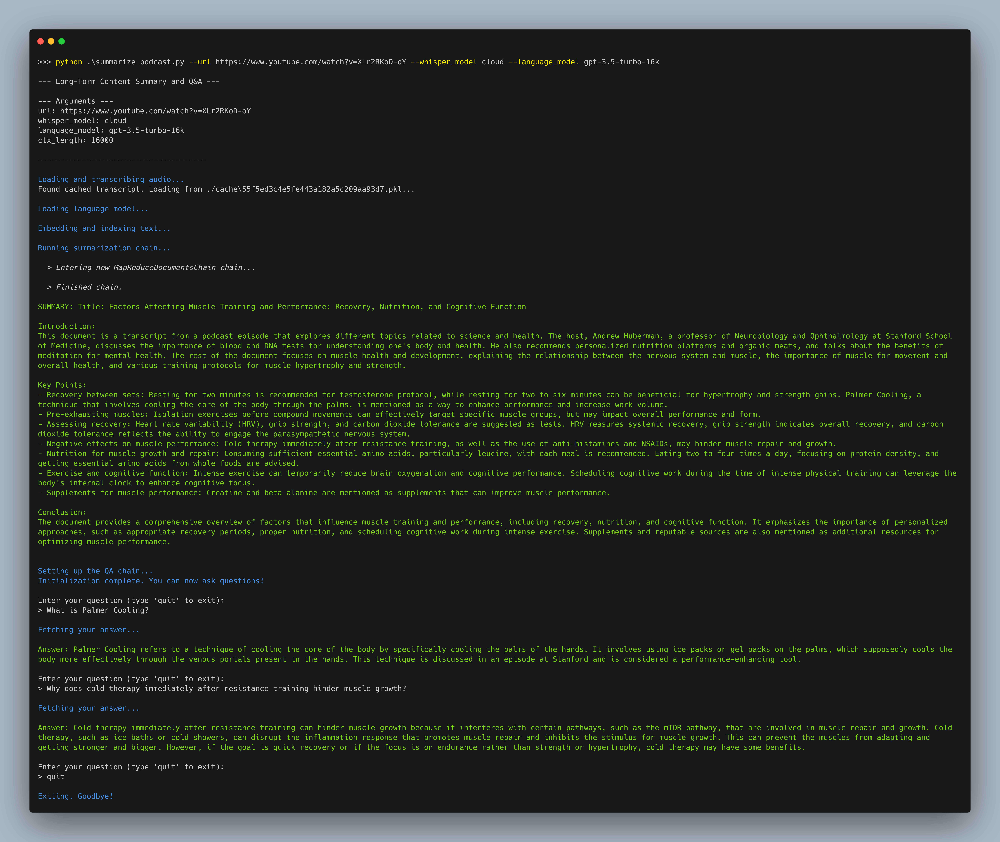

# LLM Learning Assistant: Long-Form Content Summarization and Q&A using LLMs and Retrieval-Augmented Generation

Have a 2-hour long [Huberman Lab](https://www.youtube.com/@hubermanlab) episode queued up but wish you could get a summary and ask follow-up questions instead? This project is for you!

## Features ✨

* Generates a bulleted summary and answers questions based on information retrieved from the source content
* Supports long-form content via [Map-Reduce](https://python.langchain.com/docs/modules/chains/document/map_reduce)
* Transcribes audio using OpenAI Whisper, or fetches manually-created transript directly if available
* Supports OpenAI GPT models via API, or Llama 2 running locally on CPU or GPU via [llama.cpp](https://finbarr.ca/how-is-llama-cpp-possible/)

## Usage 🔨

For long-form content, I recommend using models with at least 16k context length, such as `gpt-3.5-turbo-16k`. 

1. **If using GPT:** Place your OpenAI API key in a `.env` file as `OPENAI_API_KEY=sk-***...`
2. **If using Llama 2:** Compile and install [llama-cpp-python](https://github.com/abetlen/llama-cpp-python#installation-from-pypi) for your desired backend following the instructions.
3. `pip install -r requirements.txt`
4. `python run_summary_qa.py --help` to see the commandline options for running it

## Example 

